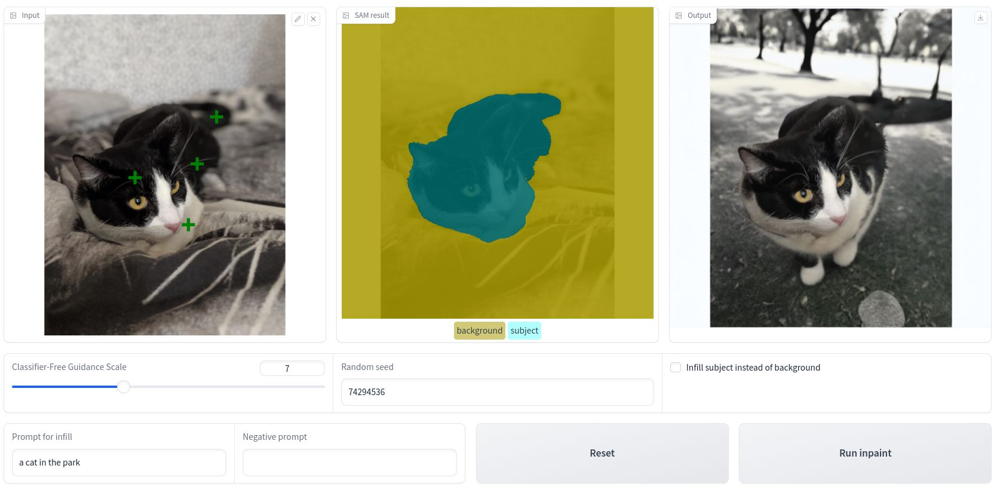
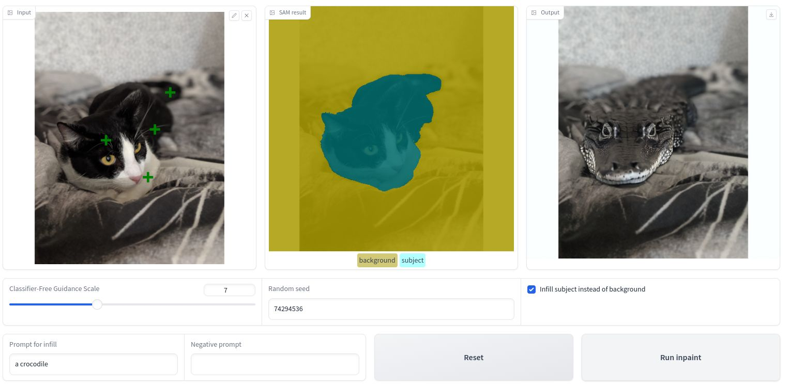

# AI Photo Editing with Inpainting

## Overview

The present project aims to develop a software application designed to facilitate the manipulation of images, enabling users to either alter the background while preserving the subject or vice versa.

The procedure involves the user uploading an image and subsequently identifying the principal object within the image by means of interactive selection. Upon selection, the Segment Anything Model (SAM) is invoked to generate a mask delineating the chosen object, with the system opting for the most precise mask produced. The user is presented with the resulting mask, affording the option to either accept it or refine it further through the addition of supplementary delineation points. Following the finalization of the mask, the user provides textual instructions, along with potentially negative prompts, specifying a new background for the selected object. Subsequently, an infill model is employed to create the desired background, culminating in the display of the modified image. Optionally, users may elect to invert the mask, thereby substituting the subject while retaining the original background, as demonstrated in the aforementioned example.

This application facilitates a variety of image manipulation tasks, including background substitution, subject substitution, object removal, and additional functionalities.

<div align="center">
  
</div>

With the app we will be able to swap out the background of an image and substitute it with a computer-generated one described through text.

<div align="center">
  
</div>

We can also substitute the subject instead of the background.

## How to execute

1 - Clone this repositoy

```bash
git clone https://github.com/Morsinaldo/GAIND-AI-Photo-Editing-with-Inpainting.git
cd GAIND-AI-Photo-Editing-with-Inpainting
```

2 - Create the virtual environment

```bash
conda create --name diffusers --python==3.9.18
```

This step uses [Anaconda](https://www.anaconda.com/) as the environment manager, but feel free to use another one of your choice.

3 - Install the requirements

```bash
pip install -r requirements.txt
```

4 - Run the [notebook](./notebook.ipynb) file.

The notebook will open a Gradio application where you can perform segmentations using SAM. It is deeply recommended to use GPU to execute the code.

## References

[Generative AI NanoDegree](https://www.udacity.com/enrollment/nd608/1.0.14)